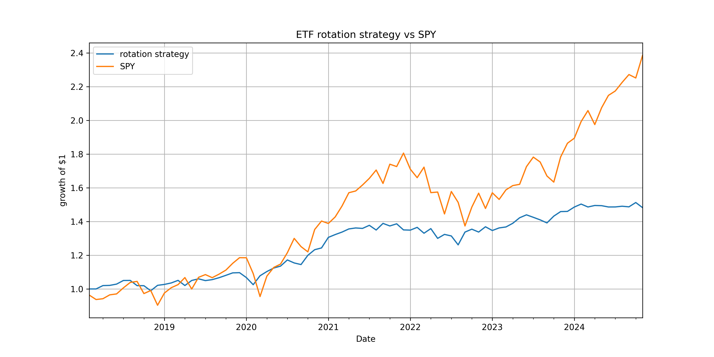

# rotation-strategy-etf

## Overview ~

This project is a ETF rotation strategy using python and historical data pulled from Yahoo Finance. It selects top performing ETFs from the 3 most recent months and rebalances monthly. This process aims to perform better than a traditional buy-and-hold benchmark.

## INTRODUCTION ~

An ETF is essentially a pre-packaged portfolio of assets that one can trade as they do a stock. It's a great way to gain broader access to markets and strategies without the hassle of individually composing a portfolio, great for passive investors. 

However, not all ETFs perform equally since the composition varies. This project aims to evaluate the strategy of rotating ETFs monthly based on their short-term performance (3 months) and compare the performance of the strategy to a passive investment in SPY (an ETF which tracks the S&P 500). 

Historical data is analyzed from both sector and global ETFs. The strategy will select the best performing ETF each month and reallocate the portfolio based on it's composition. The performance chart included in the results portion of this README will show if this strategy outperforms the more traditional SPY model. 

## LOGIC ~

universe: SPY, QQQ, IWM, EFA, EEM, XLK, XLF, XLE
frequency: monthly
ranking: most recent 3 months
allocation: equal-weight top 3 ETFs

## TOOLS USED ~

1. Jupyter Notebook 
2. Python, pandas, NumPy, yfinance, and matplotlib

## FILES ~
- notebook/etf_strategy.ipynb for complete code 
- src for modular strategy components 
- README.md for project overview 

## RESULTS ~
Below is the resulting chart which compares the ETF rotation strategy to the SPY benchmark from 2018 - 2024. 

What does this chart tell you? The Y-axis (growth of $1) shows how $1 would grow over time when invested. SPY (orange line) is the benchmark against which the rotation strategy (blue line) is compared. 

While both strategies initially move closely, the rotation strategy occaisonally outperforms. Additionally, SPY dips harder while the rotation strategy bounces back faster and more smootly. This is due to monthly rebalancing which helps avoid severe dips by dropping underperforming ETFs and buying top performing ETFs instead.  

From 2020-2021 (post-COVID dips) you can see that SPY increases sharply, while the rotation strategy rises much slower, resulting in flatter growth. Post-COVID revenue was primarily due to big tech and growth stocks. SPY tracks the S&P 500, which is composed of many tech stocks that performed wonderfully, resulting in this positive spike. However, the rotation strategy is likely selecting from a more diversified group of ETFs, and as it functions on 3-month returns it did not rotate top performers in fast enough, or rotated in ETFs that performed well short-term but were unable to sustain growth. 

In 2022, SPY shows sharp drawdowns, while the rotation strategy avoids big losses by flattening instead of severely dipping. 

Finally, the period from 2023-2024 shows that SPY skyrocketed while the rotation strategy flattened. The strongest performers of this period were big tech, specifically AI. The logic behind the lackluster performance may once again be due to a more diverse composition compared to the S&P 500's big tech concentration. 

## PERFORMANCE ANALYSIS ~

| Metric           | Rotation Strategy | SPY Benchmark |
|------------------|-------------------|----------------|
| CAGR             | 5.93%             | 13.57%         |
| Sharpe Ratio     | 0.8494            | 0.8287         |
| Max Drawdown     | -9.17%            | -23.93%        |

### *What do these metrics tell you?*

### CAGR (Compound Annual Growth Rate) -> 

this is the average annual growth rate of the investment assuming profits were reinvested and growth was compounded. Essentially, it's what one would earn each year if ETF composition remained constant. SPY's higher CAGR means reinvesting profits by sticking with SPY would result in better profits for those focused on LONG-TERM investing. 

### SHARPE RATIO (risk-adjusted return) -> 

How much excess return one is receiving against the amount of risk they're taking. This ratio is (portfolio return - risk-free rate) / standard deviation of portfolio return. Overall, a higher Sharpe Ratio is better since it means more return per unit of risk. By this metric, rotation strategy performed slightly better since it took less risk to earn similar returns. 

### MAX DRAWDOWN -> 

"Drawdown" meausures decline from a peak to a trough in this chart. From this, one can see how much the investment dropped in value before recovering, and is expressed as percentage rather than a difference. Rotation strategy had a lower max drawdown, meaning that less value was lost before recovery. This is the main benefit of rotating since there is less volatility. 

OVERALL, the SPY model is better for long-term investments and maximum growth, but for those seeking more stability, the rotation strategy would be the more sensible choice. Limiting losses and maintaining steadier returns may hold more value in uncertain markets. 

### *Thank you for viewing! <3 - kera*
